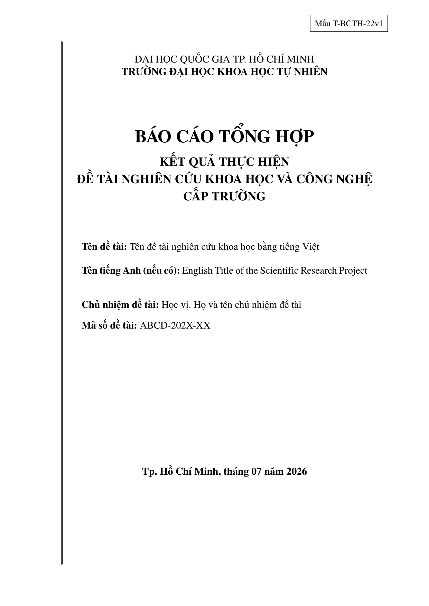
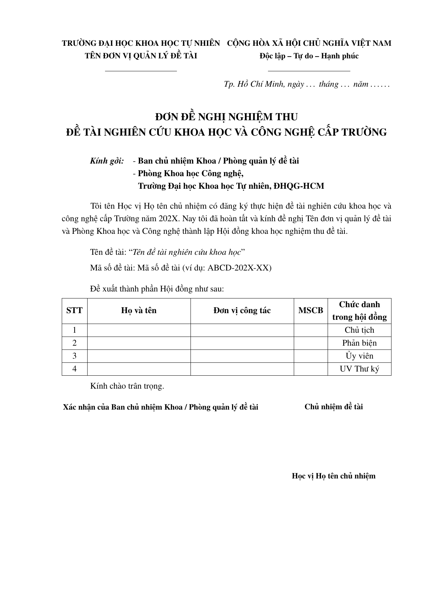

# Welcome to the HCMUS Unofficial Templates Wiki!

This Wiki contains the detailed documentation, guidelines, and troubleshooting tips for the unofficial LaTeX templates of the Ho Chi Minh City University of Science (HCMUS).

> [!CAUTION]
> **These templates are unofficial, entirely community-run, and not endorsed by HCMUS.**
> 
> It is provided 100% free of charge via this official repository and the listed Overleaf links. If you paid money for this, you have been scammed. 
> We make no guarantees that your department's formatting committee won't reject this layout (along with your graduation timeline). Please consult your academic office or advisor before use to save your own sanity. We also take zero responsibility for sketchy copies downloaded from random third-party forums.
> 
> If it compiles and breaks, you get to keep both pieces. To report bugs or offer therapy to the maintainers, please open an issue or write to `thquan (at) fit.hcmus.edu.vn`.

---

## 🎓 Master's Thesis Template

This template is designed for formatting a Master's Thesis in Computer Science according to the layout guidelines of the university.

### 🎨 Previews
Here is a side-by-side preview of the compiled thesis layout:

| Trang bìa | Trang thông tin | Lời cảm ơn | Nội dung chương | Tài liệu tham khảo |
| :---: | :---: | :---: | :---: | :---: |
|  |  |  |  |  |
### 📖 User Guides

All detailed setup, structure, and compilation guides have been consolidated into a single comprehensive page:

👉 **[Go to Master's Thesis Template Documentation](Master-Thesis)**

---

## 📄 Report Template

This template is designed for standard course reports, lab assignments, and homework submissions.

### 🎨 Previews
Here is a side-by-side preview of the compiled report layout:

| Trang bìa | Hình ảnh | Bảng biểu | Mã nguồn (C++/Python) |
| :---: | :---: | :---: | :---: |
|  |  |  |  |

### 📖 User Guides

All detailed setup, structure, and compilation guides have been consolidated into a single comprehensive page:

👉 **[Go to Report Template Documentation](Report)**

---

## 🔬 Scientific Project Template

This template is designed for academic scientific research projects, including the final report and the formal acceptance board request form. The template files are located in the [scientific-research/](https://github.com/khongsomeo/hcmus-unofficial-report-template/tree/main/scientific-research) directory.

### 🎨 Previews
Here is a side-by-side preview of the compiled project layout:

| Trang bìa báo cáo | Đơn đề nghị nghiệm thu |
| :---: | :---: |
|  |  |

### 📖 User Guides

All detailed setup, structure, and compilation guides have been consolidated into a single comprehensive page:

👉 **[Go to Scientific Project Template Documentation](Scientific-Project)**

